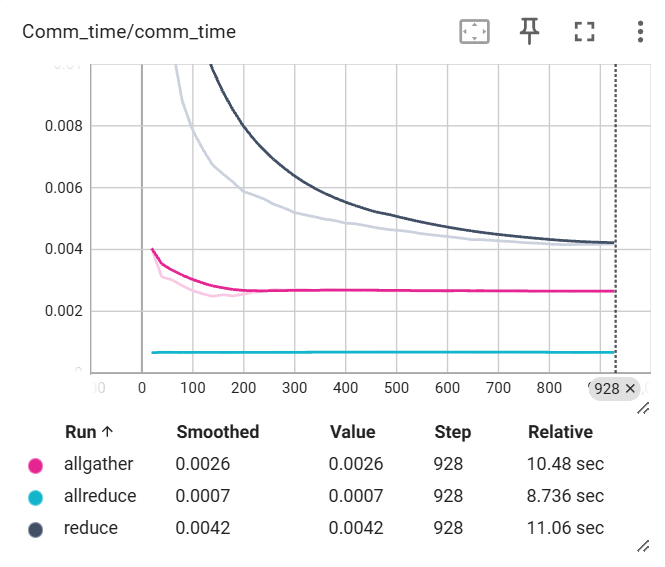
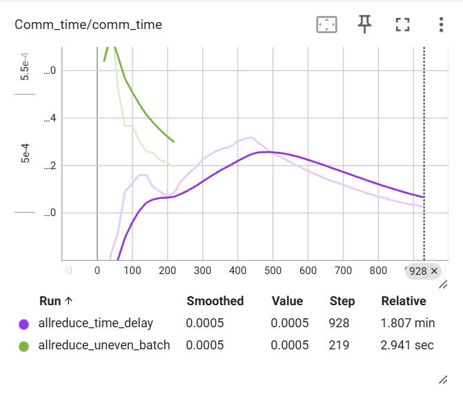
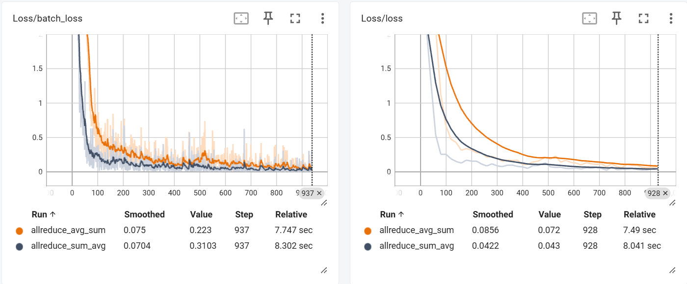
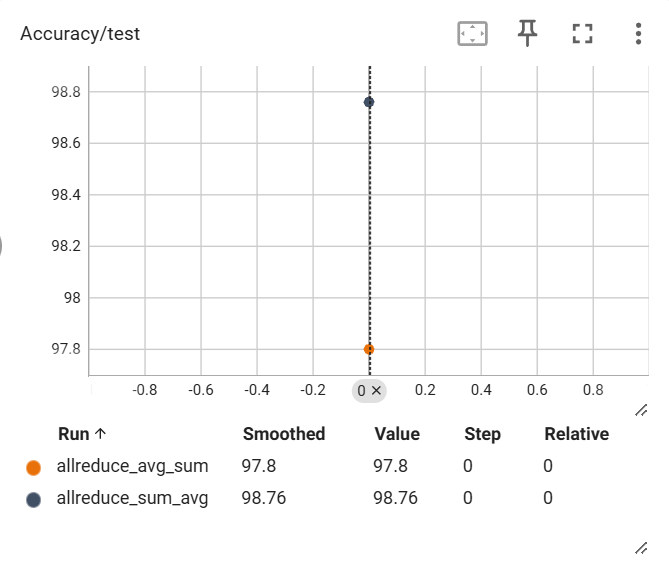

### TASK2 通信模型与参数聚合
#### 实现集体通信下的参数（梯度）聚合，基于至少 3 种集体通信原语实现梯度平均的聚合方法，并比较它们的通信时间开销，分析不同聚合策略对模型性能的影响；

**核心代码**
- allreduce
```py
def allreduce_average_gradients(model):
    for param in model.parameters():
        # implement your own aggregation method
        if param.grad is not None:
            dist.all_reduce(param.grad.data, op=dist.ReduceOp.AVG)

```

  - reduce
```py
def reduce_average_gradients(model):
        """Average gradients using Reduce collective operation"""
        world_size = get_world_size()
        rank = get_local_rank()
    
    for param in model.parameters():
        if param.grad is not None:
            # Use reduce with AVG operation to rank 0, then broadcast back
            if rank == 0:
                # Rank 0 receives and averages gradients
                temp_grad = param.grad.data.clone()
                for src_rank in range(1, world_size):
                    dist.recv(temp_grad, src=src_rank)
                    param.grad.data += temp_grad
                param.grad.data /= world_size
            else:
                # Other ranks send their gradients to rank 0
                dist.send(param.grad.data, dst=0)
            
            # Broadcast the averaged gradients from rank 0 to all processes
            dist.broadcast(param.grad.data, src=0)
```

  - allgather
```py
def allgather_average_gradients(model):
    world_size = get_world_size()
    for param in model.parameters():
        if param.grad is not None:
            # Gather gradients from all processes
            gathered_grads = [torch.zeros_like(param.grad.data) for _ in range(world_size)]
            dist.all_gather(gathered_grads, param.grad.data)
            
            # Average the gathered gradients
            avg_grad = torch.stack(gathered_grads).mean(dim=0)
            param.grad.data = avg_grad
```


**实验结果：**
| 通信原语 | 平均通信时间 (ms) | Acc | 备注 |
|----------|---------------|----------|------|
| allreduce |    0.7           |     98.1     |      |
| reduce    |       4.2        |    98.06      |      |
| allgather |        2.6       |      97.89    |      |

**性能分析**
如图展示了随训练进程通信时间的变化。

可以看到reduce随训练进行通信时间不断降低；
allgather也有降低趋势，但整体缓慢；
reduce在整个训练过程中保持了稳定的通信时间；
从性能上来看all reduce > reduce > allgather;


#### 计算瓶颈点

设置两类瓶颈：
- 算力不均瓶颈
通过设置某一个节点每次计算后产生固定延时模拟
- 数据不均瓶颈
通过为不同节点分配不均匀的batch_size实现


| 计算瓶颈 | Acc | 备注 |
|----------|---------------|----------|------|
| allreduce w time delay |    97.86     |      |
| allreduce w uneven_batch |     94.16      |      |


- 算力瓶颈
由于AllReduce要求所有节点都到达同步点后才能开始通信，因此慢节点成为“拖尾节点”（straggler）：
所有其他节点在计算结束后被迫等待慢节点到达同步位置；
从表面上看，通信时间（AllReduce 耗时）被显著拉长；
实际上拉长的时间并非通信本身变慢，而是通信操作被迫等待慢节点的到达。
- 数据瓶颈
在设置不均衡 batch size 的实验中，不同节点处理的数据量不同（例如 rank1 的 batch size 明显更大）。这同样会导致节点间的计算时间差异：
batch 越大，计算时间越长；
处理更多样本的节点变成拖尾节点；
其他节点依然必须等待所有节点完成反向计算后才能开始梯度同步。

#### 不同聚合策略在训练的不同阶段对收敛速度的影响
实验设置：
实验采取两种聚合策略的组合：
- avg_sum：
使用allreduce通信方式，前一半epoch使用avg聚合，后一半epoch使用sum聚合；
- sum_avg:
使用allreduce通信方式，前一半epoch使用sum聚合，后一半epoch使用avg聚合；
结果如图所示：




在训练早期使用sum聚合，后期使用avg聚合，模型收敛速度更快，且性能更好；
收敛速度分析：由于sum聚合直接对各个节点的梯度值进行加和，且没有经过专门的归一化，在更新是的步长更大，因此收敛更大；
性能分析：由于策略二在训练后期使用步长更大的sum聚合，可能会导致模型在后期收敛时出现震荡现象，从而导致性能上不如后期使用步长更小的avg聚合方式。