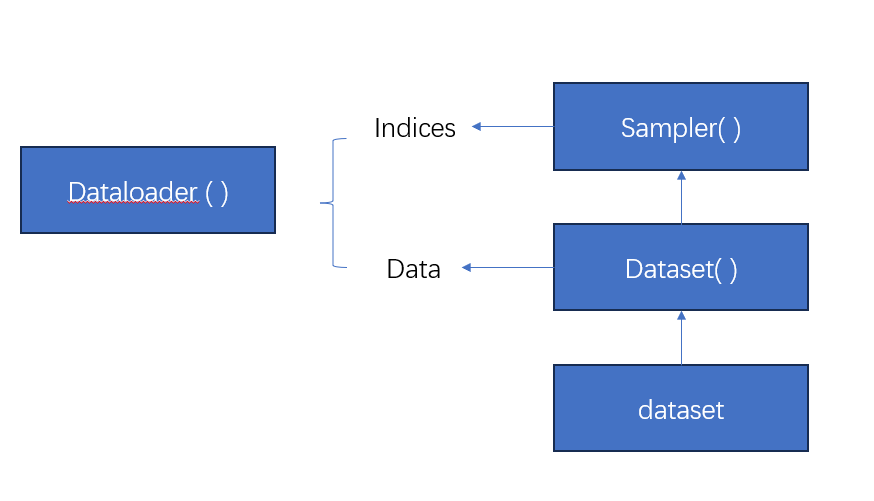
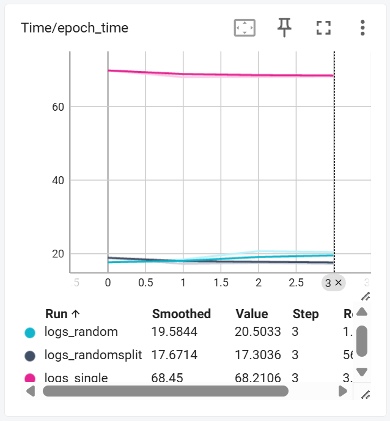
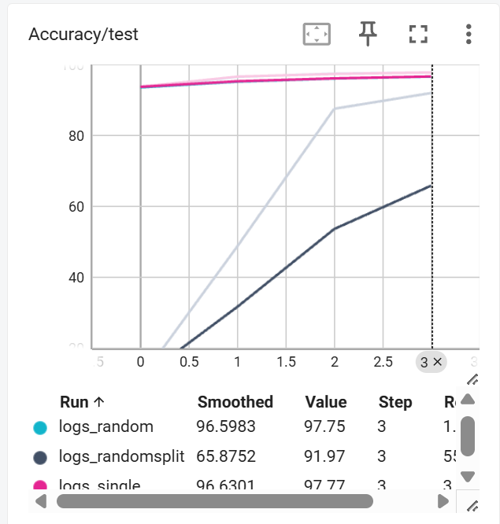

### 实验三（1）数据并行

#Dataset、Sampler、DataLoader 的关系分析

在 PyTorch 的分布式数据并行（DDP）训练中，数据加载机制由 **Dataset、Sampler、DataLoader** 三个组件共同完成。三个组件在数据流上呈以下关系：

1. **Dataset** 提供原始数据样本。
2. **Sampler** 根据策略生成样本索引。
3. **DataLoader** 利用 Sampler 取出索引，调用 Dataset 获取样本，最后组合成 batch。

## Dataset：提供数据访问接口
**作用**：负责存储和管理原始数据（如图像、文本、特征向量等）。

**核心功能：**
- `__getitem__(idx)`：返回第 idx 个样本  
- `__len__()`：返回数据集大小  

**特点**：
- 只负责“数据是什么”
- 不负责打乱数据、不负责划分 batch

---

## Sampler：决定样本索引的生成方式
Sampler 决定 DataLoader **以什么顺序、哪些样本索引** 将被取出，是分布式数据并行的核心组成部分。

**常见 Sampler：**
- `RandomSampler`（随机采样）
- `DistributedSampler`（按 rank 自动划分）

**核心职责：**
- 控制不同节点的数据划分（避免重复）
- 决定每轮训练的样本顺序
- 实现：
  - `__iter__()`：返回索引迭代器  
  - `__len__()`：返回当前 rank 的样本数  

**本实验需要实现：**
- 随机采样 Sampler
- 随机划分 Sampler

---

## DataLoader：执行批量加载与数据预处理
**主要功能：**
- 从 Sampler 获取样本索引
- 调用 Dataset 的 `__getitem__` 获取真实数据
- 将多个样本组合成 batch
- 多线程加速（`num_workers`）

本质上 DataLoader 是 **Dataset + Sampler 的调度执行器**。

---

# 🔄 三者关系总结



#### Sampler类实现

RandomSample:
```py
class RandomSampler(Sampler):
    """
    每个 epoch 对全集数据随机打乱，然后全部返回。
    不做分布式划分（每个 rank 拿相同的随机序列）。
    """
    def __init__(self, dataset: Dataset, shuffle=True, seed=0):
        self.dataset = dataset
        self.shuffle = shuffle
        self.seed = seed
        self.epoch = 0

    def __iter__(self):
        indices = list(range(len(self.dataset)))

        if self.shuffle:
            # 每个 epoch 生成不同随机序列
            g = torch.Generator()
            g.manual_seed(self.seed + self.epoch)
            indices = torch.randperm(len(self.dataset), generator=g).tolist()

        return iter(indices)

    def __len__(self):
        return len(self.dataset)
```


RandomsplitSampler
```py
class RandomSplitSampler(Sampler):
    """
    随机划分采样：
    - 先对全集随机打乱
    - 再按 num_replicas 划分为 num_replicas 份
    - 每个 rank 拿自己的那一份
    """
    def __init__(self, dataset: Dataset, num_replicas, rank, shuffle=True, seed=0):
        self.dataset = dataset
        self.num_replicas = num_replicas
        self.rank = rank
        self.shuffle = shuffle
        self.seed = seed
        self.epoch = 0
        self.num_samples = math.ceil(len(self.dataset) / self.num_replicas)

    def __iter__(self):
        indices = list(range(len(self.dataset)))

        if self.shuffle:
            g = torch.Generator()
            g.manual_seed(self.seed + self.epoch)
            indices = torch.randperm(len(self.dataset), generator=g).tolist()

        # --- 按 rank 划分 ---
        start = self.rank * self.num_samples
        end = min(start + self.num_samples, len(self.dataset))
        split_indices = indices[start:end]

        return iter(split_indices)

    def __len__(self):
        return self.num_samples

```

#### 数据并行对于相对于单机训练的性能指标提升
- 数据并行可以加速模型训练



使用4个节点进行数据并行，训练速度比单机训练快了3倍；

- 随机划分（RandomSplit）会导致性能相比random采样和单机训练的性能下降，这可能是由于split的操作导致每个节点的梯度带偏差，最终导致性能下降。



- 随机采样（Random）不会产生每次训练都从全集抽样的情况，每次训练会从全集随机抽样，梯度无偏，没有产生性能下降的情况。
#### 思考题

**目标**
有 4 个训练节点（记为 1..4），它们对数据的可见性受限：
节点1 能看到样本编号 {0,1,2}（3 个样本）
节点2 能看到 {3,4,5}（3 个样本）
节点3 能看到 {6,7}（2 个样本）
节点4 能看到 {8,9}（2 个样本）
这是 数据分布不均且可能分布不一致（non-iid） 的典型情形。目标：在不做或尽量少做全量数据迁移的前提下提高训练性能（收敛速度 / 最终泛化 / 通信效率）。

提升训练性能的可行策略：
A. 数据划分 / 采样 策略（减少 non-iid 与不均衡带来的偏差）
目标：减少各节点数据分布差异或通过采样/扩充等手段“模拟”更均衡的训练数据分布。
- 跨节点样本重放（Partial data exchange / proxy exchange）
  - 思路：定期在节点间交换一小部分样本索引或合成样本（例如每 node 分享 1 个样本给其它节点）而不是全量迁移。
  - 理由：小量样本交换可以快速降低数据异质性，从而减少梯度偏差。理论上，增加相同样本在不同节点出现的概率，会使本地梯度期望更接近全局梯度。
  - 方法论：工程化：每隔𝐸个全局同步轮，随机抽取每节点𝑚个样本的索引并通过网络发送（或直接发送数据的压缩表示/特征），𝑚取 1 或 2 即可在小数据集上见效。

B. 梯度聚合 / 优化 算法（降低梯度偏差、提升收敛速度、节约通信）
目标：通过智能的聚合或局部优化规则来抵消非 iid 和不均衡的影响。
- 按样本数加权平均
  - 方法：在同步阶段，用每节点样本数作为权重做聚合;
  - 分析：如果不进行加权聚合，会导致数据多的节点被低估或小节点被过度放大，产生偏差。