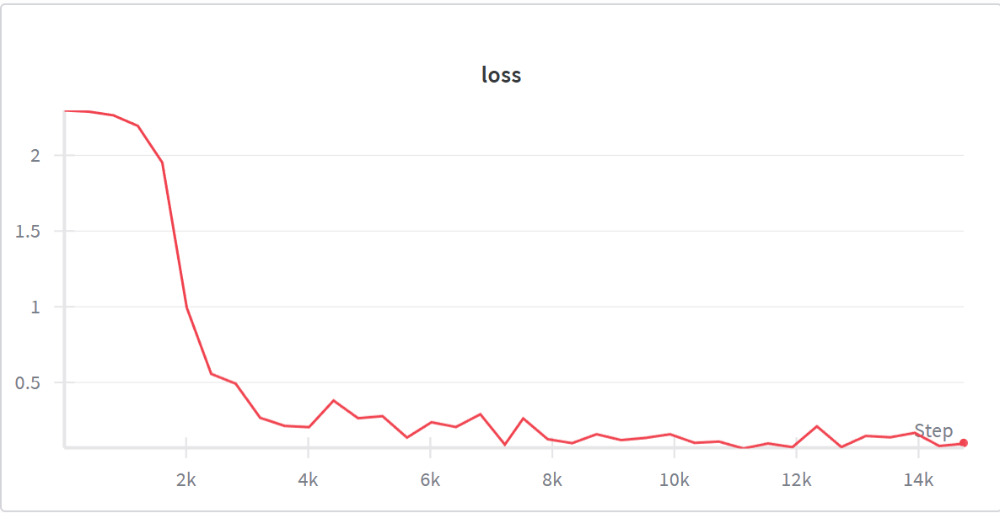
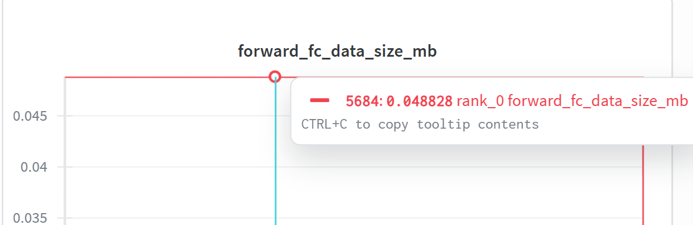
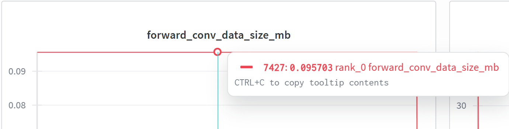
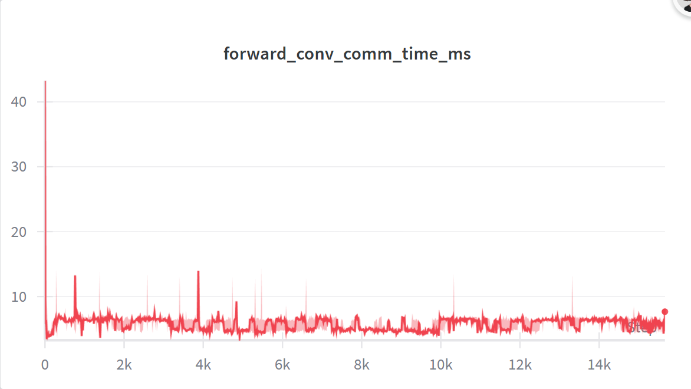
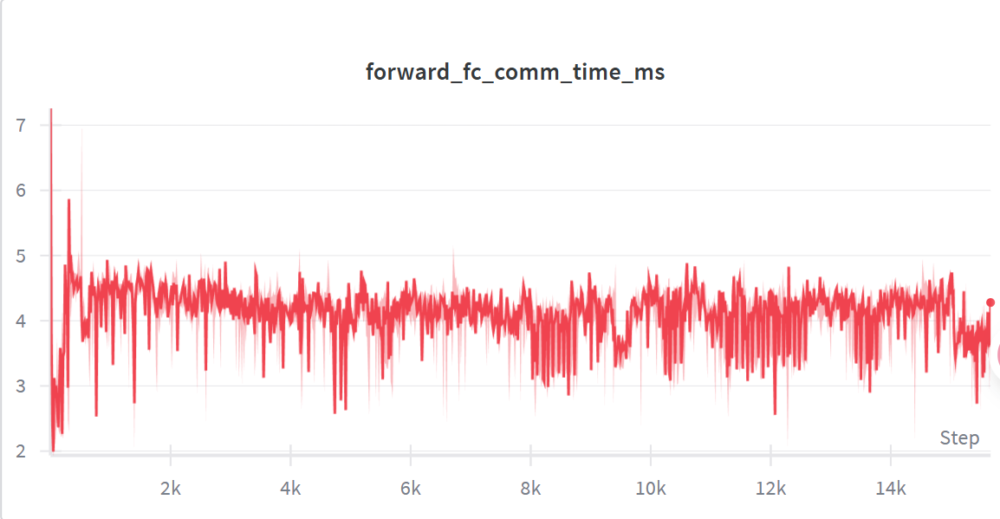

### 实验三 (2)：**模型并行实验**

关键代码如下：
模型并行网络
```py
class ParallelNet(nn.Module):
    def __init__(self, in_channels=1, num_classes=10):
        super().__init__()
        print(f"Initializing ParallelNet on worker {dist_utils.get_local_rank()}...")
        
        # 将两个子网络分别放置在 worker1 / worker2
        print(f"Creating remote SubNetConv on worker1...")
        self.conv_rref = rpc.remote("worker1", SubNetConv, args=(in_channels,))
        print(f"Creating remote SubNetFC on worker2...")
        self.fc_rref   = rpc.remote("worker2", SubNetFC, args=(num_classes,))
        print(f"ParallelNet initialization complete.")

    def forward(self, x):
        # 将 x 放入 RRef
        x_rref = rpc.RRef(x)

        # 调用远程卷积网络
        start_time = time.time()
        y_rref = self.conv_rref.rpc_async().forward(x_rref)
        y = y_rref.wait()
        end_time = time.time()
        comm_time = (end_time - start_time) * 1000 # ms
        data_size = (x.nelement() * x.element_size()) / (1024 * 1024) # MB
        wandb.log({"forward_conv_comm_time_ms": comm_time, "forward_conv_data_size_mb": data_size, "forward_conv_bandwidth_mb_s": data_size / (comm_time / 1000) if comm_time > 0 else 0})

        # 调用远程全连接网络
        start_time = time.time()
        out_rref = self.fc_rref.rpc_async().forward(rpc.RRef(y))
        out = out_rref.wait()
        end_time = time.time()
        comm_time = (end_time - start_time) * 1000 # ms
        data_size = (y.nelement() * y.element_size()) / (1024 * 1024) # MB
        wandb.log({"forward_fc_comm_time_ms": comm_time, "forward_fc_data_size_mb": data_size, "forward_fc_bandwidth_mb_s": data_size / (comm_time / 1000) if comm_time > 0 else 0})
        return out

    def parameter_rrefs(self):
        """Fetch remote parameters for DistributedOptimizer."""
        params = []
        # 使用 rpc_sync 从远端 SubNet 对象上同步调用 parameter_rrefs()
        params.extend(self.conv_rref.rpc_sync().parameter_rrefs())
        params.extend(self.fc_rref.rpc_sync().parameter_rrefs())
        return params

```

分布式训练

```py
def train(model, dataloader, loss_fn, optimizer, num_epochs=2):
    print("Device {} starts training ...".format(dist_utils.get_local_rank()))
    model.train()
    dist_utils.init_parameters(model)

    for epoch in range(num_epochs):
        for i, (inputs, labels) in enumerate(dataloader):
            # 1. 创建一个分布式 autograd 上下文
            with dist_autograd.context() as context_id:

                # 2. 远程前向
                outputs = model(inputs)

                # 3. 损失
                loss = loss_fn(outputs, labels)

                # 4. 反向传播（跨机器）
                start_time = time.time()
                dist_autograd.backward(context_id, [loss])
                end_time = time.time()
                comm_time = (end_time - start_time) * 1000 # ms
                # Approximate data size (gradients)
                data_size = sum(p.numel() * p.element_size() for p in model.parameters()) / (1024 * 1024) # MB
                wandb.log({"backward_comm_time_ms": comm_time, "backward_data_size_mb": data_size, "backward_bandwidth_mb_s": data_size / (comm_time / 1000) if comm_time > 0 else 0})

                # 5. 更新分布式参数
                start_time = time.time()
                optimizer.step(context_id)
                end_time = time.time()
                comm_time = (end_time - start_time) * 1000 # ms
                data_size = sum(p.numel() * p.element_size() for p in model.parameters()) / (1024 * 1024) # MB
                wandb.log({"optimizer_comm_time_ms": comm_time, "optimizer_data_size_mb": data_size, "optimizer_bandwidth_mb_s": data_size / (comm_time / 1000) if comm_time > 0 else 0})

            if i % 100 == 0:
                print(f"[Epoch {epoch}] step {i}, loss = {loss.item():.4f}")
                wandb.log({"loss": loss.item()})

    print("Training Finished!")
```

wandb初始化
```py
wandb.init(entity="zhiminwang", project="dml_exp_25fall_task4", name=f"rank_{args.rank}")
```

在两个节点上进行训练，一个节点用于存放模型的卷积层部分，另一个节点用于存放模型的全连接部分。
训练结果如下：
```
Test set: Accuracy: 9690/10000 (96.90%)
```

- 训练过程
- loss曲线如图所示：

    
    模型在经过大约900步后收敛。

- 通信数据量对比
  - 卷积层通信数据量


    
  - 全连接层通信数据量

    

卷积层需要通信的数据量更大。


- 通信时间对比
  - 卷积层通信时间

    

  - 全连接层通信时间


    
    
    
