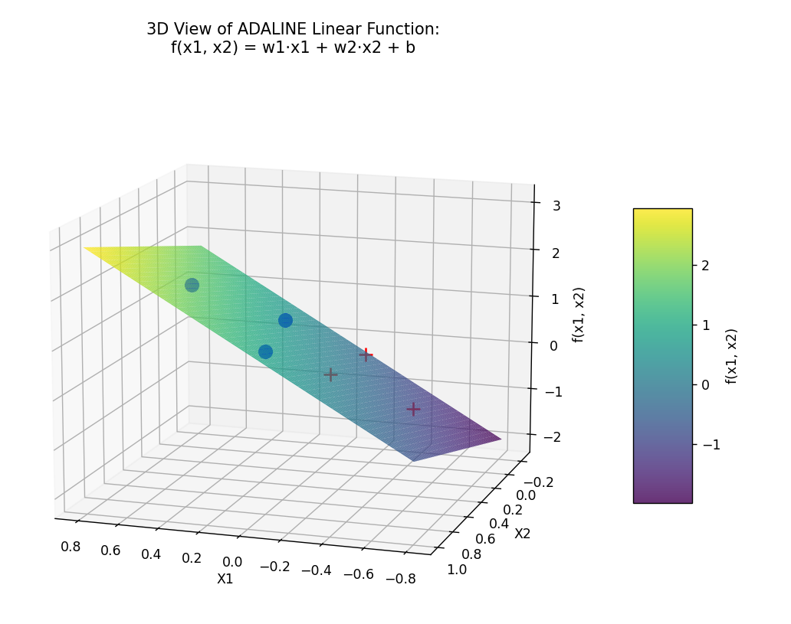
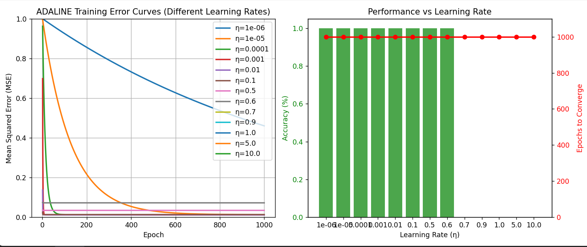
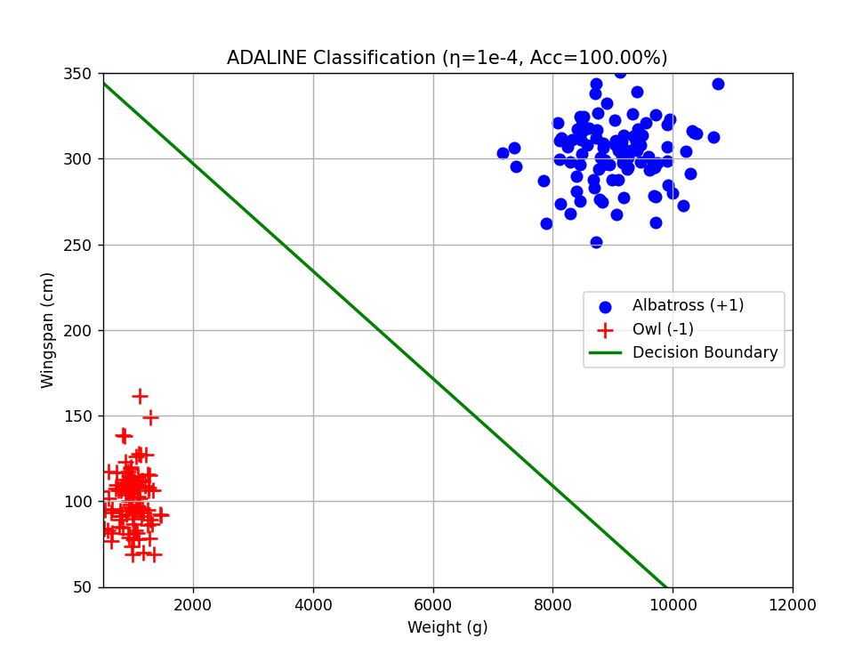

#### Adaline网络

1. LMS 核心代码
```python
def adaline_train(x_data, d_data, eta=0.5, max_epochs=100):
    """
    ADALINE (LMS) 训练函数
    返回：最终权重 [b, w1, w2]，以及每轮的均方误差（MSE）
    """
    w = np.array([0.0, 0.0, 0.0])  # [b, w1, w2]
    mse_history = []

    for epoch in range(max_epochs):
        errors = []
        for x, d in zip(x_data, d_data):
            x_vec = np.array([1, x[0], x[1]])  # [bias, x1, x2]
            y_hat = np.dot(w, x_vec)  # 线性输出
            error = d - y_hat
            w = w + eta * error * x_vec
            errors.append(error**2)

        mse = np.mean(errors)
        mse_history.append(mse)

        if mse < 1e-5:  # 收敛阈值
            print(f"✅ 在第 {epoch + 1} 轮后收敛！MSE = {mse:.6f}")
            break

    return w, mse_history
```

2. 线性分类界面函数可视化


由图所示，经过adaline学习后的平面在f(x1,x2)方向把样本点分割在0的两边

Adaline和感知机算法优劣对比：
- ADALINE 的优势：
    - 更稳定、更平滑：
    - 更新基于连续梯度，不易因单个样本剧烈震荡。
    - 对噪声或异常点鲁棒性更好。

- 感知机的优势：
  - 简单直观：
只需判断符号，计算量小。
  - 收敛速度快（在线性可分时）：
只要分类错误，就一步到位修正，有时比 LMS 收敛更快。
  - 适合硬分类任务：
直接输出类别标签，无需额外阈值。


#### 选做：鸟类分类实验


结论：
- 当学习率**超过0.6时**,神经元训练不再收敛
- 学习率越低，收敛需要的训练轮数越多

**两类数据分布和分割平面**

