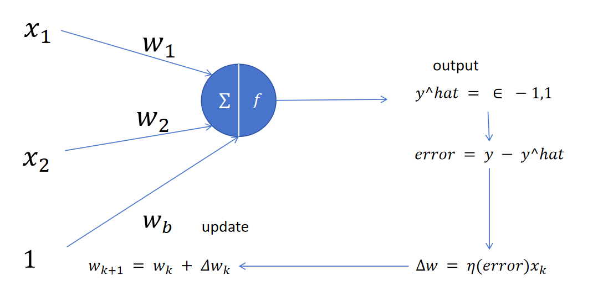
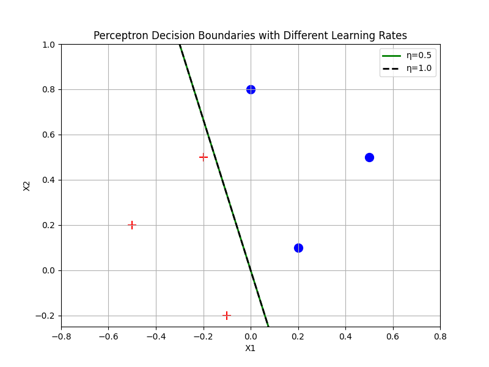

### 两类问题
**1.网络结构图：**


**核心代码：**
```python
import matplotlib.pyplot as plt

# 数据
xdim = [(-0.1, -0.2), (0.5, 0.5), (-0.5, 0.2), (-0.2, 0.5), (0.2, 0.1), (0.0, 0.8)]
ddim = [-1, 1, -1, -1, 1, 1]

def perceptron_train(x_data, d_data, eta=0.5, max_epochs=100):
    w = np.array([0.0, 0.0, 0.0])
    for epoch in range(max_epochs):
        errors = 0
        for x, d in zip(x_data, d_data):
            x_vec = np.array([1, x[0], x[1]])
            net = np.dot(w, x_vec)
            o = 1 if net >= 0 else -1
            if o != d:
                w += eta * (d - o) * x_vec
                errors += 1
        if errors == 0:
            print(f"η={eta}: 第 {epoch + 1} 轮收敛")
            break
    return w
```
**2.线性分类边界结果图:**

**结论** ： 不同学习速率对于训练收敛的影响
```
对于线性可分数据，感知机总能收敛；
学习率不影响最终分类边界，只影响权重的缩放；
学习率越大，单次更新幅度越大，但收敛轮数可能相同（本例中都是 2 轮）；
```


#### 多类问题
1. 核心代码
```python
class MultiClassPerceptron:
    def __init__(self, n_classes=7, n_features=63, eta=0.5):
        self.n_classes = n_classes
        self.eta = eta
        # 每个类一个权重向量 (b, w1, ..., w63)
        self.weights = np.zeros((n_classes, n_features + 1))  # shape: (7, 64)

    def predict(self, x):
        """x: (63,) → 返回预测类别索引"""
        x_bias = np.concatenate([[1], x])  # (64,)
        outputs = np.dot(self.weights, x_bias)  # (7,)
        return np.argmax(outputs)  # 返回最大输出的索引

    def train(self, X, y, epochs=10):
        """X: (n_samples, 63), y: (n_samples, 7) one-hot"""
        for epoch in range(epochs):
            errors = 0
            for i in range(len(X)):
                x = X[i]
                true_label = np.argmax(y[i])  # 0~6
                x_bias = np.concatenate([[1], x])
                outputs = np.dot(self.weights, x_bias)
                pred = np.argmax(outputs)

                # 对每个神经元更新
                for c in range(self.n_classes):
                    d = 1 if c == true_label else -1
                    o = 1 if outputs[c] >= 0 else -1
                    if o != d:
                        self.weights[c] += self.eta * (d - o) * x_bias
                        errors += 1
            if errors == 0:
                print(f"✅ 第 {epoch+1} 轮收敛！")
                break

    def add_noise(self, x, n_points=1):
        """在 x 中随机翻转 n_points 个像素 (-1 ↔ 1)"""
        x_noisy = x.copy()
        indices = random.sample(range(len(x)), n_points)
        for idx in indices:
            x_noisy[idx] = -x_noisy[idx]
        return x_noisy

    def test_with_noise(self, X, y, n_noise=1, n_trials=10):
        correct = 0
        total = len(X) * n_trials
        for x, label in zip(X, y):
            true_class = np.argmax(label)
            for _ in range(n_trials):
                x_noisy = self.add_noise(x, n_noise)
                pred = self.predict(x_noisy)
                if pred == true_class:
                    correct += 1
        return correct / total
```

2. 一个噪声点效果
```
实验设置:
训练阶段：
学习率为0.5 感知机在4个轮次后收敛每个字符
测试阶段：
随机加噪10次生成10个噪声样本，总计10*21 = 210个噪声样本，1个噪声点准确率为99.05%

```

#### 选做内容
1. 两个噪声点效果
```
实验设置:
训练阶段：
学习率为0.5 感知机在4个轮次后收敛每个字符
测试阶段：
随机加噪10次生成10个噪声样本，总计10*21 = 210个噪声样本，1个噪声点准确率为98.10%
```

2. 训练集不同实验

- 情况1： 只使用没有噪声的七个字母进行训练；
```
实验设置:
训练阶段：
学习率为0.5 感知机在4个轮次后收敛每个字符
测试阶段：
随机加噪10次生成10个噪声样本，总计10*21 = 210个噪声样本：
1 个噪声点准确率: 99.05%
2 个噪声点准确率: 98.10%
```

- 情况2： 使用没有噪声和有一个噪声点的样本进行训练；

```
训练阶段：
学习率为0.5 感知机在4个轮次后收敛每个字符
测试阶段：
总计21*2 = 42个噪声样本：
1 个噪声点准确率: 99.05%
2 个噪声点准确率: 99.52%
```

结果表明，在训练集中扩充了噪声样本后，模型对于带噪声样本的预测能力增强了（两个噪声点样本情况下，相对提升1.42%）。

3. 不同学习率对比
```
--- 学习率 η=0.1 ---
第 5 轮收敛
1 个噪声点准确率: 100.00%
2 个噪声点准确率: 98.57%

--- 学习率 η=0.5 ---
第 4 轮收敛
1 个噪声点准确率: 99.52%
2 个噪声点准确率: 97.62%

--- 学习率 η=1.0 ---
第 4 轮收敛！
1 个噪声点准确率: 99.52%
2 个噪声点准确率: 99.52%
```

学习率更小（η=0.1）的训练设置需要更多的轮次（5轮相比4轮）才能收敛到局部最优点，也因为训练步长较小因此模型可以收敛到更加接近局部最优点附近的区域，模型预测能力更好（0.95%的性能提升）。但η=0.5和η=1.0模型效果相同，可能是因为都导致在最优点附近摆荡，或者由于测试集样本分布不够均匀。

#### 完整训练结果如下：
```

============================================================
实验一：对比仅用原始数据 vs 原始+噪声数据训练

--- 方法一：仅使用原始数据训练 ---
✅ 第 4 轮收敛！
训练轮数: None
1 个噪声点准确率: 99.05%
2 个噪声点准确率: 98.10%

--- 方法二：使用原始数据 + 1个噪声点增强数据训练 ---
✅ 第 4 轮收敛！
训练轮数: None
1 个噪声点准确率: 99.05%
2 个噪声点准确率: 99.52%

📊 性能对比总结:
仅原始数据 -> 1噪准确率: 99.05%, 2噪准确率: 98.10%
增强数据 -> 1噪准确率: 99.05%, 2噪准确率: 99.52%
============================================================
实验二：对比不同学习率 (η=0.1, 0.5, 1.0)

--- 学习率 η=0.1 ---
✅ 第 5 轮收敛！
训练轮数: None
1 个噪声点准确率: 100.00%
2 个噪声点准确率: 98.57%

--- 学习率 η=0.5 ---
✅ 第 4 轮收敛！
训练轮数: None
1 个噪声点准确率: 99.52%
2 个噪声点准确率: 97.62%

--- 学习率 η=1.0 ---
✅ 第 4 轮收敛！
训练轮数: None
1 个噪声点准确率: 99.52%
2 个噪声点准确率: 99.52%
```