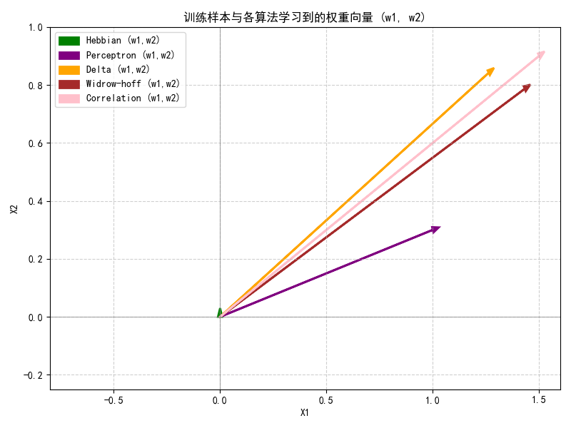

#### 必做
1.学习算法核心代码
```python
class UnifiedNeuron:
    def __init__(self, algorithm='hebbian', learning_rate=0.5, init_weights=None):
        self.eta = learning_rate
        self.algorithm = algorithm.lower()
        if init_weights is None:
            self.w = np.array([0.0, 0.0, 0.0])  # [b, w1, w2]
        else:
            self.w = np.array(init_weights, dtype=float)
    
    def activate(self, net):
        if self.algorithm == 'perceptron':
            return sign(net)
        else:
            return tanh(net)
    
    def update(self, x, d):
        x_vec = np.array([1.0, x[0], x[1]])  # [bias, x1, x2]
        net = np.dot(self.w, x_vec)
        
        if self.algorithm == 'hebbian':
            o = tanh(net)
            r = o
        elif self.algorithm == 'perceptron':
            o = sign(net)
            r = d - o
        elif self.algorithm == 'delta':
            o = tanh(net)
            deriv = tanh_derivative(net)
            r = (d - o) * deriv
        elif self.algorithm == 'widrow-hoff':
            # LMS: linear output, no activation
            o = net
            r = d - o
        elif self.algorithm == 'correlation':
            r = d
        else:
            raise ValueError(f"Unknown algorithm: {self.algorithm}")
        
        delta_w = self.eta * r * x_vec
        self.w += delta_w
    
    def train(self, x_data, d_data, epochs=2):
        for _ in range(epochs):
            for x, d in zip(x_data, d_data):
                self.update(x, d)
        return self.w.copy()
```

2. 权重系数结果
```
经过 2 轮训练后的权重结果 (w1, w2, b)：
Hebbian        : w1 =   0.0000, w2 =   0.0000, b =   0.0000
Perceptron     : w1 =   1.0000, w2 =   0.3000, b =   0.0000
Delta          : w1 =   1.2633, w2 =   0.8420, b =   0.1585
Widrow-hoff    : w1 =   1.4326, w2 =   0.7867, b =   0.2705
Correlation    : w1 =   1.5000, w2 =   0.9000, b =   0.0000
```

#### 选做
1. 权重系数空间位置（向量）

2. 不同算法对于神经元权系数的影响
```
1. Hebbian—— 无监督，只依赖自身输出
权重更新方向完全由输入与当前输出决定。
在本任务中，由于初始权重为 0，初始输出接近 0，导致学习信号极小，权重变化非常微弱。
最终权重 (w₁, w₂) 接近原点，几乎无判别能力。
结论：不适合有监督分类任务，因其无法利用标签信息。
2. Perceptron（感知机）—— 有监督，硬判决
特点：使用二值输出 sgn(net) ，误差为 d−o∈{−2,0,2} 。
影响：
只要分类错误，就沿输入方向大幅修正权重（步长固定为 η⋅∣d−o∣=1.0 ）。
对线性可分数据能快速收敛。
本数据集线性可分，经 2 轮后已得到较大权重。
结论：对分类错误敏感，更新剧烈，适合线性可分问题。
3. Delta 规则 —— 有监督，软判决 + 梯度缩放
特点：使用连续激活函数 tanh ，并乘以其导数
学习信号被“缩放”：当输出接近饱和（±1）时，导数趋近 0，更新变慢；当 net 接近 0 时，更新最快。
权重变化比 Perceptron 更平滑、更小，因为误差被非线性压缩。
最终权重略小于 Perceptron。
结论：梯度敏感，适合连续优化，但收敛可能较慢。
4. Widrow-Hoff（LMS）—— 有监督，线性输出
特点：无激活函数，直接用线性输出计算误差。
影响：
误差信号为 d−net ，可为任意实数，更新幅度更“精细”。
比 Delta 规则更新更大，比 Perceptron 更连续。
权重通常介于 Delta 与 Perceptron 之间。
结论：适用于回归或带连续误差的分类，收敛稳定。
5. Correlation（外积规则）—— 监督死记忆
特点：直接累加 η * d *x ，完全忽略当前输出和误差。
影响：
本质上是样本的加权和，不考虑当前模型状态。
在本例中，因样本分布和标签对称性，结果与 Perceptron 巧合相同。
结论：简单粗暴，无纠错能力，仅适用于理想记忆或初始化。
```