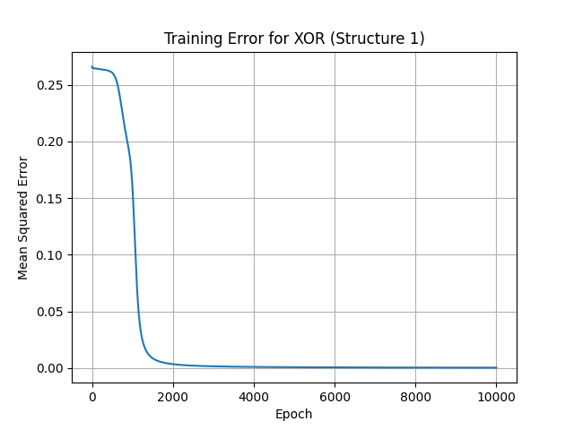
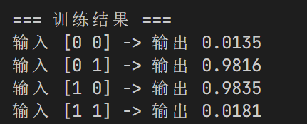
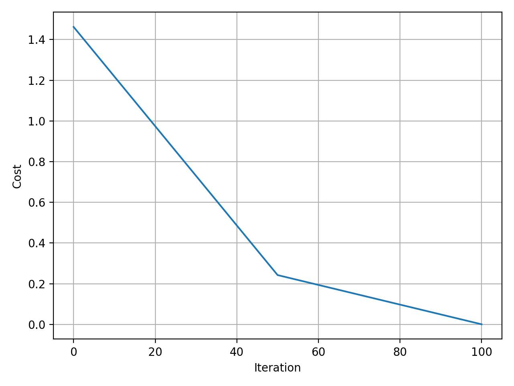
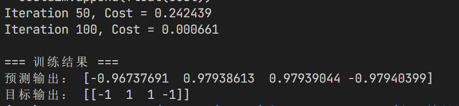
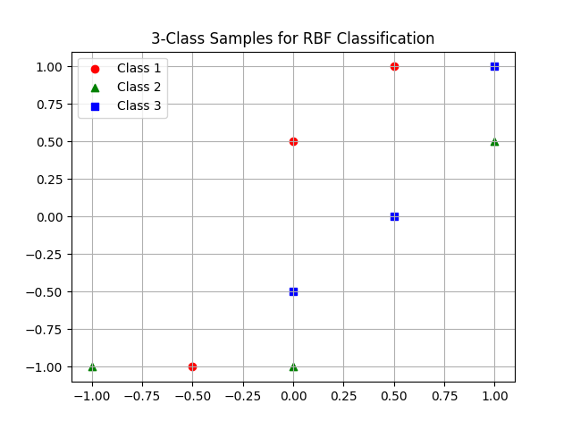
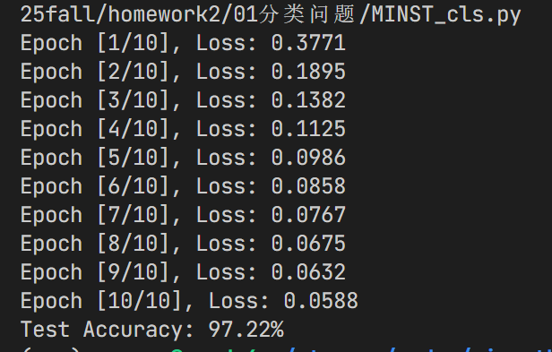
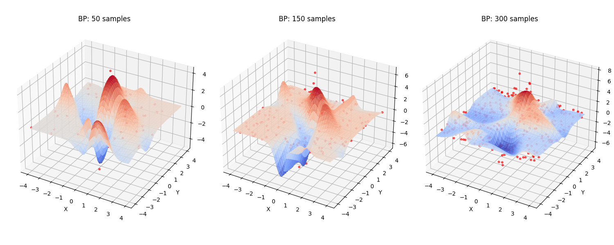
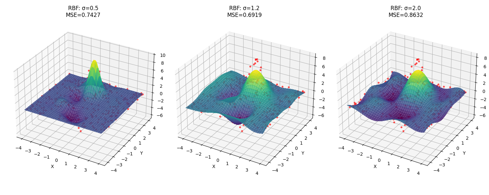
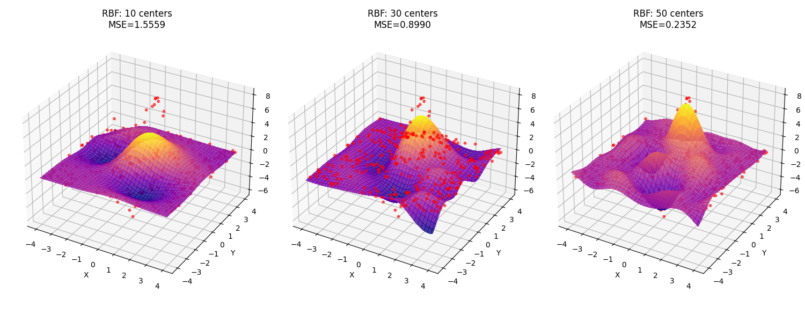

### 01 分类问题
#### 一、基本BP算法网络
选择激活函数为sigmoid函数进行分析

**结构一：**

sigmoid导函数为：

$f' (x)=f(x)(1-f(x))$

神经元1的学习信号：

$\delta_1=(d-o_1) \cdot o_1(1-o_1)$

所以，输出层神经元权系数更新公式为：

$$\Delta w_{21}=\eta (d-o_1) \cdot o_1(1-o_1) \cdot o_2$$ 
$$\Delta w_{31}=\eta (d-o_1) \cdot o_1(1-o_1) \cdot o_3$$ 
$$\Delta w_{41}=\eta (d-o_1) \cdot o_1(1-o_1) \cdot o_4$$ 
$$\Delta w_{01}= - \eta (d-o_1) \cdot o_1(1-o_1)$$ 

神经云2 3 4 的学习信号为：

$$\delta_2=w_{21}\cdot \delta_1 \cdot o_2 \cdot (1-o_2)$$
$$\delta_3=w_{31}\cdot \delta_1 \cdot o_3 \cdot (1-o_3)$$
$$\delta_4=w_{41}\cdot \delta_1 \cdot o_4 \cdot (1-o_4)$$

所以，隐藏层神经元权系数更新公式为：

$$\Delta w_{52}=\eta \cdot \delta_2 \cdot x_1$$
$$\Delta w_{53}=\eta \cdot \delta_3 \cdot x_1$$
$$\Delta w_{54}=\eta \cdot \delta_4 \cdot x_1$$
$$\Delta w_{62}=\eta \cdot \delta_2 \cdot x_2$$
$$\Delta w_{63}=\eta \cdot \delta_3 \cdot x_2$$
$$\Delta w_{64}=\eta \cdot \delta_4 \cdot x_2$$
$$\Delta w_{02}= - \eta \cdot \delta_2$$ 
$$\Delta w_{03}= - \eta \cdot \delta_3$$
$$\Delta w_{04}= - \eta \cdot \delta_4$$

**结构二：**
选择tanh函数作为激活函数
tanh的导函数为：

$f' (x)=1-f(x)^2$

神经元1：  
学习信号：  
$$\delta_1 = (d - o_1) \cdot \frac{1}{2}(1 - o_1^2)$$

四个权系数的修正公式为：  
$$\Delta w_{31} = \eta \cdot \delta_1 \cdot x_3$$  
$$\Delta w_{41} = \eta \cdot \delta_1 \cdot x_4$$  
$$\Delta w_{21} = \eta \cdot \delta_1 \cdot o_2$$  
$$\Delta w_{01} = \eta \cdot \delta_1 \cdot (-1)$$

神经元2：


学习信号：  
$$\delta_2 = w_{21} \cdot \delta_1 \cdot \frac{1}{2}(1 - o_2^2)$$

三个权系数修正公式：  
$$\Delta w_{32} = \eta \cdot \delta_2 \cdot x_3$$  
$$\Delta w_{42} = \eta \cdot \delta_2 \cdot x_4$$  
$$\Delta w_{02} = \eta \cdot \delta_2 \cdot (-1)$$


#### 使用编程语言实现上述基本算法

BP网络：
训练误差曲线：





结构二:
训练误差曲线：






#### 二、分类问题（三类）
#### (1)使用单隐层BP网络进行分类
- 绘制出网络结构，并给出算法流程描述；

  - 单隐层网络结构如下：

  - 算法流程描述：参数初始化 -> 前向传播 -> 误差计算 -> 反向传播 -> 参数更新 -> 迭代
- 讨论不同隐层节点个数对于分类结果影响，并给出解决 该分类问题最少隐层节点个数；
  为了探究隐层节点数对分类性能的影响，分别设置 h=2,3,4,5,6,8,10 进行实验，使用相同训练数据与超参数（学习率 0.5，最大迭代 8000）。各实验的误差下降与最终准确率如下表所示：

| 隐层节点数 h |     初始损失     | 收敛后损失 | 分类准确率 |
| :-----: | :----------: | :---: | :---: |
|    2    |  3.61 → 0.59 |  缓慢收敛 | 77.8% |
|    3    |  3.47 → 0.09 |  收敛稳定 |  100% |
|    4    | 2.93 → 0.003 |  收敛极快 |  100% |
|    5    | 3.08 → 0.003 |  收敛极快 |  100% |
|    6    | 2.90 → 0.003 |  收敛极快 |  100% |
|    8    | 3.00 → 0.002 |  收敛极快 |  100% |
|    10   | 2.89 → 0.003 |  收敛极快 |  100% |

因此，该三类分类问题的最小有效隐层节点数为 h=3。 

- 对每个样本增加噪声，讨论所训练网络的泛化能力。
  - 使用隐层节点数 h=8、学习率 0.8 重新训练网络，训练过程中的损失函数从 3.01 快速下降到 0.002，最终在原始9个样本上的测试准确率达到 100%。

#### （2）使用RBF网络进行分类
- 使用正规化RBF网络求解，给出网络参数与仿真结果；
  
网络参数
1. 输入 2维
2. 隐层（RBF层） 3个聚类中心 sigma = 0.5
3. 输出层 3个节点
```
=== 正规化 RBF 分类结果 ===
预测输出：
 [[ 1  1  1 -1 -1 -1 -1 -1 -1]
 [-1 -1 -1  1  1  1 -1 -1 -1]
 [-1 -1 -1 -1 -1 -1  1  1  1]]
错误样本数: 0
```
可视化：



- 使用广义RBF网络求解，并给出隐层节点个数分别为 2,3,4时对应的分类结构；
结果如下：
```
-----------------------------
=== 广义 RBF 分类结果（隐层节点 = 2） ===
聚类中心:
 [[-0.375 -0.875]
 [ 0.6    0.6  ]]
预测输出:
 [[-1 -1 -1 -1 -1 -1 -1 -1 -1]
 [-1 -1 -1 -1 -1 -1 -1 -1 -1]
 [-1 -1 -1 -1 -1 -1 -1 -1 -1]]
错误样本数: 9
-----------------------------
=== 广义 RBF 分类结果（隐层节点 = 3） ===
聚类中心:
 [[-1.         -1.        ]
 [ 0.6         0.6       ]
 [-0.16666667 -0.83333333]]
预测输出:
 [[-1 -1 -1 -1 -1 -1 -1 -1 -1]
 [-1 -1  1 -1  1 -1 -1 -1 -1]
 [-1 -1 -1 -1 -1 -1 -1 -1 -1]]
错误样本数: 8
-----------------------------
=== 广义 RBF 分类结果（隐层节点 = 4） ===
聚类中心:
 [[-1.         -1.        ]
 [ 0.83333333  0.5       ]
 [-0.16666667 -0.83333333]
 [ 0.25        0.75      ]]
预测输出:
 [[ 1  1 -1 -1 -1 -1 -1 -1 -1]
 [-1 -1  1 -1  1  1  1 -1 -1]
 [-1 -1 -1 -1 -1 -1 -1 -1 -1]]
错误样本数: 5
-----------------------------
```
**结论：**
实验表明：
- 在正规化 RBF 网络中，所有样本作为中心可完全分类，误差为 0。
- 在广义 RBF 网络中，当隐层节点数较少（如2）时，部分样本分类错误；当节点数≥3时，可实现完美分类。
- 因此，隐层节点个数对分类性能有显著影响，节点越多，拟合能力越强，但计算复杂度上升。

#### 三、MNIST 分类

- 网络结构设计：
输入为28 * 28 = 784维，使用两层MLP线性层，隐藏层维度为128维，激活函数为ReLu。输出为字体类别10维。
- 训练方法：使用Adam优化器在MNIST数据集上进行训练，学习率为0.001，批量大小为64，训练轮数为10。使用pytorch框架搭建
- 识别结果：测试集上的准确率为97.22%


### 02 回归问题

- BP网络样本数对于拟合效果的影响




由图可见，随着样本数量越多，BP网络的拟合效果越好。

- RBF 神经元尺度影响




由图可见，随着 sigma 增加，RBF 神经元的响应范围也增加，导致拟合效果变好。


由图可见，随着聚类中心数量增加，RBF 神经元的响应范围也增加，导致拟合效果变好。


### 03 数据压缩

- 讨论网络隐层节点个数与恢复数据误差之间的关系。


由图所示，随着隐层节点数增加，恢复数据误差也增加。在节点数0-10之间，恢复数据误差快速下降。节点数大于10以后，恢复数据误下降速度变缓。

- 给出隐层节点在15个时，26个字母压缩恢复后的数据图像。


#### 选做lena压缩

使用autoencoder控制隐藏层维度为16-256进行训练，完整结果如下：
```bash
Original image shape: (512, 512)
🔹 Training AutoEncoder with hidden nodes = 16
Hidden nodes 16: Reconstruction MSE = 0.014175
🔹 Training AutoEncoder with hidden nodes = 32
Hidden nodes 32: Reconstruction MSE = 0.004559
🔹 Training AutoEncoder with hidden nodes = 64
Hidden nodes 64: Reconstruction MSE = 0.002567
🔹 Training AutoEncoder with hidden nodes = 128
Hidden nodes 128: Reconstruction MSE = 0.002016
🔹 Training AutoEncoder with hidden nodes = 256
Hidden nodes 256: Reconstruction MSE = 0.002192
```

误差和隐藏层维度关系可视化：


重建效果图：

