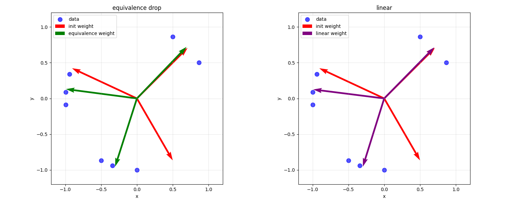
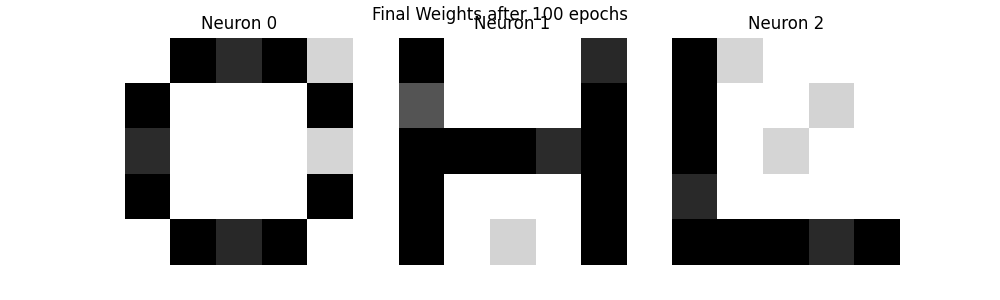
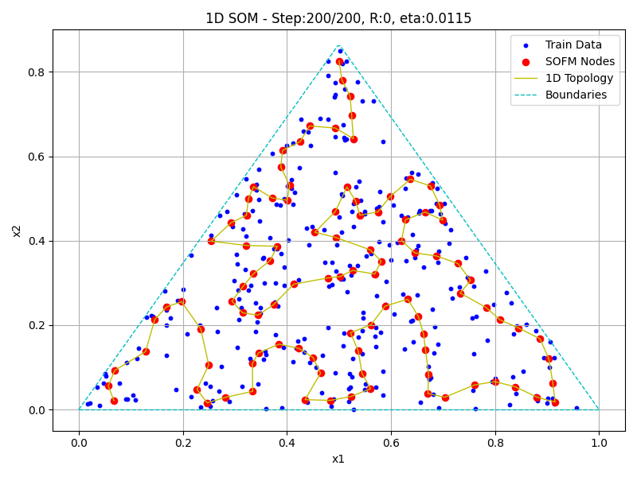
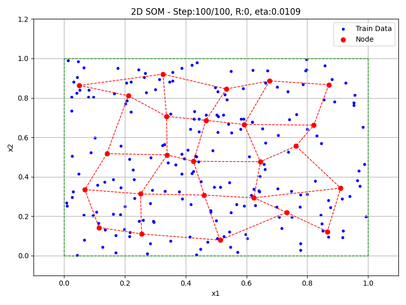
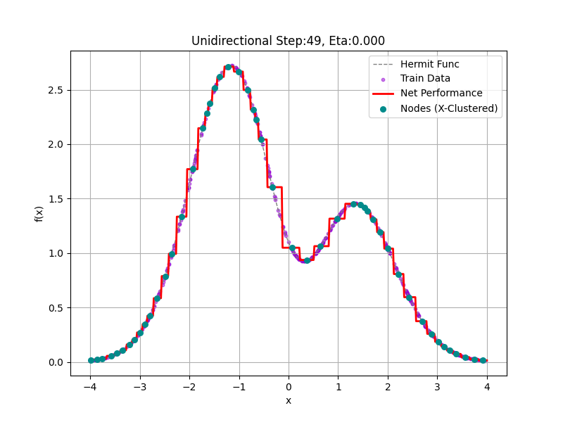
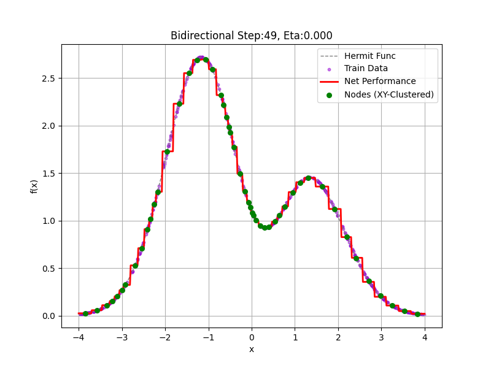

### 作业三
#### 题目一：竞争神经元
(1) 经过一次调整的权重系数结果：
```plain
初始权重:
 [[ 0.70710677  0.70710677]
 [-0.9063078   0.42261827]
 [ 0.5        -0.8660254 ]]
第一次迭代后权重 :
 [[ 0.6370073   0.77085775]
 [-0.9689457   0.24727377]
 [-0.35759223 -0.9338778 ]]
```

(2) 循环训练，训练次数N=100。讨论一下两种学习速率下的训练结果，并对比。
等比下降：
```
最终权向量 (等比下降):
 [[ 0.6925376   0.7213818 ]
 [-0.9914168   0.13073933]
 [-0.3041042  -0.9526388 ]]
```
线性下降：
```
最终权向量 (线性下降):
 [[ 0.6994114   0.7147193 ]
 [-0.99208343  0.12558003]
 [-0.2985113  -0.95440614]]
```

两种学习速率在100轮的训练情况下都能很好地完成训练。权重最终收敛到相似的结果，这说明两种学习速率都能有效地训练竞争神经元模型。



#### 题目二
(1) 最终的训练后三个神经元的内星向量结果



(2) 验证三个字母其它剩余的20个噪声样本在该竞争网络的识别性能

```
=== Recognition Test on Remaining Noise Samples ===
C: accuracy = 20/20 = 1.00
H: accuracy = 20/20 = 1.00
L: accuracy = 20/20 = 1.00
```
可以良好的识别剩余带噪声的样本

#### 题目三 点阵聚类

(3) 竞争层分别采用三种不同的拓扑结构，讨论训练结果。
采用相同的训练轮次，训练结果如下：
- 0维拓扑
```
Final Result (0D Topology):
------------------------------------------------------------
Clustering Result (5x5 Grid):
 1.        2.        3.III     4.        5.       
 6.NOQ     7.        8.        9.       10.       
11.H      12.       13.       14.HOHO   15.GGG    
16.       17.       18.       19.       20.       
21.       22.       23.NQNQ   24.       25.UUU    
------------------------------------------------------------
```

- 一维拓扑：
```
Final Result (1D Topology):
------------------------------------------------------------
Clustering Result (5x5 Grid):
 1.II      2.        3.I       4.        5.N      
 6.        7.OQ      8.        9.H      10.       
11.GG     12.       13.G      14.       15.UUU    
16.       17.HH     18.       19.OO     20.       
21.N      22.       23.N      24.       25.QQ     
------------------------------------------------------------
```
- 二维拓扑：
```
Final Result (2D Topology):
------------------------------------------------------------
Clustering Result (5x5 Grid):
 1.        2.I       3.        4.OQ      5.       
 6.II      7.        8.H       9.       10.N      
11.       12.UUU    13.       14.QQ     15.       
16.G      17.       18.HH     19.       20.NN     
21.       22.GG     23.       24.OO     25.       
------------------------------------------------------------
```
在相同轮次下，二维拓扑聚类效果更好，但也存在部分分类错误，如`O`和`Q`被错误地聚类为同一类。

#### 选做 ABCDEFJK
```
Final Result (0D Topology):
------------------------------------------------------------
Clustering Result (5x5 Grid):
 1.        2.        3.CCC     4.        5.       
 6.BED     7.        8.        9.       10.       
11.K      12.       13.       14.KEKE   15.AAA    
16.       17.       18.       19.       20.       
21.       22.       23.BDBD   24.       25.JJJ    
------------------------------------------------------------
```

- 一维拓扑：
```
Final Result (1D Topology):
------------------------------------------------------------
Clustering Result (5x5 Grid):
 1.CC      2.        3.C       4.        5.B      
 6.        7.ED      8.        9.K      10.       
11.AA     12.       13.A      14.       15.JJJ    
16.       17.KK     18.       19.EE     20.       
21.B      22.       23.B      24.       25.DD     
------------------------------------------------------------
```
- 二维拓扑：
```
Final Result (2D Topology):
------------------------------------------------------------
Clustering Result (5x5 Grid):
 1.        2.C       3.        4.ED      5.       
 6.CC      7.        8.K       9.       10.B      
1.        12.JJJ    13.       14.DD     15.       
16.A      17.       18.KK     19.       20.BB     
1.        22.AA     23.       24.EE     25.       
------------------------------------------------------------
```

在相同轮次下，二维拓扑聚类效果更好，但也存在部分分类错误，如`E`和`D`被错误地聚类为同一类。


#### 题目五 SOFM保序特性


“保序”特性是自组织映射 (SOFM/SOM) 最重要的特点。它指的是：网络能够将高维输入空间中样本之间的拓扑关系（即邻近性）保留下来，并映射到低维（1D 或 2D）竞争层中。
在 1D 竞争层中，相邻的神经元（在 1 到 100 的索引序列中相邻）通过黄线连接。图中黄线平滑、连续地覆盖了三角形区域，有效地将二维的三角形数据分布映射到了一个一维的神经元序列上，成功地保持了数据的邻近性关系。

#### 选做：2D拓扑


#### 题目6 旅行商问题

结果如下：


选做结果如下：


#### 题目7 使用CPN实现函数逼近
(1) 构造单向CPN和双向CPN完成上述网络并进行训练。

单向CPN训练结果

双向CPN训练结果


(2) 对比在相同的20个隐层节点的情况下，两种CPN逼近函数的精度。

通过上述两幅图片的对比，可以看到双向CPN的函数逼近结果要好于单向CPN的函数逼近结果。