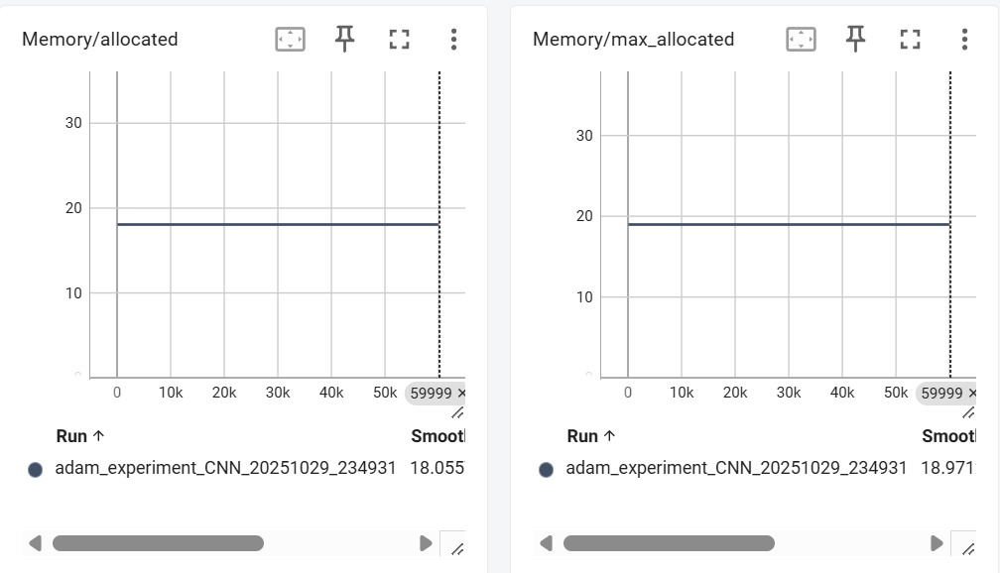

### 实验一：梯度下降单机优化
#### 在 MNIST 数据集上完成图像分类任务

#### 参考 SGD 的实现示例，实现 SGDM、ADAM 两种基于梯度的优化方法，写出两个优化器类
关键代码：
```py
class SGDMOptimizer(BaseOptimizer):
    def __init__(self, params, lr=0.001, beta1=0.9):
        super().__init__(params, lr)
        self.beta1 = beta1
        self.state = dict()
        for p in self.params:
            self.state[p] = dict()
            self.state[p]['t'] = 0
            self.state[p]['m'] = 0  # 一阶动量
            
    def step(self):
        for p in self.params:
            if p.grad is None:
                continue
            
            self.state[p]['t'] += 1
            
            # SGDM公式: m_t = β1 * m_{t-1} + (1 - β1) * g_t
            self.state[p]['m'] = self.beta1 * self.state[p]['m'] + (1 - self.beta1) * p.grad
            
            # 参数更新: w = w - lr * m_t
            p.data.add_(self.state[p]['m'], alpha=-self.lr)
            
class AdamOptimizer(BaseOptimizer):
    def __init__(self, params, lr=0.001, beta1=0.9, beta2=0.999, eps=1e-8):
        super().__init__(params, lr)
        self.beta1 = beta1
        self.beta2 = beta2
        self.eps = eps
        self.state = dict()
        for p in self.params:
            self.state[p] = dict()
            self.state[p]['t'] = 0
            self.state[p]['m'] = 0  # 一阶动量
            self.state[p]['V'] = 0  # 二阶动量
            
    def step(self):
        for p in self.params:
            if p.grad is None:
                continue
            
            self.state[p]['t'] += 1
            t = self.state[p]['t']
            
            # Adam公式: m_t = β1 * m_{t-1} + (1 - β1) * g_t
            self.state[p]['m'] = self.beta1 * self.state[p]['m'] + (1 - self.beta1) * p.grad
            # Adam公式: V_t = β2 * V_{t-1} + (1 - β2) * (g_t)^2
            self.state[p]['V'] = self.beta2 * self.state[p]['V'] + (1 - self.beta2) * (p.grad ** 2)
            
            # 偏差修正: m_hat_t = m_t / (1 - β1^t)
            m_hat = self.state[p]['m'] / (1 - self.beta1 ** t)
            # 偏差修正: V_hat_t = V_t / (1 - β2^t)
            V_hat = self.state[p]['V'] / (1 - self.beta2 ** t)
            
            # 参数更新: w = w - lr * m_hat_t / (sqrt(V_hat_t) + eps)
            p.data.add_(-self.lr * m_hat / (torch.sqrt(V_hat) + self.eps))

```

#### 绘制两种优化方法下的 loss 函数变化图像；

**sgdm**


**adam**


#### 比较 SGDM 和 ADAM 两个方法的优劣，这两个方法的表现和超参数、模型选择有什么关系？请给出必要的实验和理论分析来说明；

- 固定学习率，研究动量大小
    - **Adam** beta1 = [0.5 0.9 0.99 0.999] beta2 = [0.5 0.9 0.999]
    结论：过小的beta1 或 beta2 会导致模型无法收敛； beta1 或 beta2 越靠近1，在相同的训练轮数下性能更好。 


  - **SGDM** beta1 = [0.5 0.9 0.99]
   结论：beta1 越靠近1，在相同的训练轮数下性能更好。


- 固定动量大小，研究学习率
    - **Adam** lr = [0.0001 0.001 0.01 0.1]
  结论：lr 越小，在相同的训练轮数下性能越好。较大的学习率会导致训练时震荡，无法收敛。


    - **SGDM** lr = [0.0001 0.001 0.01 0.1]
   结论：lr 越小，在相同的训练轮数下性能越好。较大的学习率会导致训练时震荡，无法收敛。


- 固定训练参数，研究模型
  - CNN
  - MLP (保持各层输入输出维度不变，将两层卷积层替换为全连接层得到)
  核心代码如下：
  ```py
  class MLPNet(nn.Module):
    """
    多层感知机网络，保持与Net类相同的层数，但全部使用全连接层
    """
    def __init__(self, input_size=784, num_classes=10):
        super(MLPNet, self).__init__()
        
        # 第一层：输入层到隐藏层1 (784 -> 6*28*28)
        self.fc1 = nn.Linear(input_size, 6*28*28)
        # 第二层：隐藏层1到隐藏层2 (6*28*28 -> 16*5*5)
        self.fc2 = nn.Linear(6*28*28, 16*5*5)
        # 第三层：隐藏层2到隐藏层3 (16*5*5 -> 120)
        self.fc3 = nn.Linear(16*5*5, 120)
        # 第四层：隐藏层3到输出层 (120 -> num_classes)
        self.fc4 = nn.Linear(120, num_classes)
    
    def forward(self, x):
        """
        Args:
            x: (b, 1, 28, 28) 或 (b, 784)
        """
        # 如果输入是图像格式，先展平
        if x.dim() == 4:
            x = x.flatten(1)
        
        # 第一层：输入层到隐藏层1
        out = F.relu(self.fc1(x))
        # 第二层：隐藏层1到隐藏层2
        out = F.relu(self.fc2(out))
        # 第三层：隐藏层2到隐藏层3
        out = F.relu(self.fc3(out))
        # 第四层：隐藏层3到输出层
        out = self.fc4(out)

        return out
  ```


结论：收敛速度基本一致，CNN表现更好，推测为模型优势

#### 使用以 tensorboard 为代表的可视化方法分析机器学习过程中的显存占用、时间开销等变化。
以adam为例：
- 显存占用：


显存占用在350MB左右 恒定不变

- 反向传播；前向推理；优化器；总计时间：


单次反向传播时间平均为2.5024ms，训练过程中产生了波动
单次正向推理时间平均为0.5903ms，训练过程中产生了波动
单次优化器更新参数时间平均为1.8632ms，训练过程中产生了波动
单次总计时间平均为7.1466ms （包含程序其他进程的总计时间）