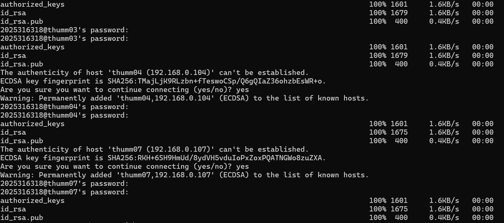

### 实验一 Linux基础实验
#### 任务1. 使⽤ssh远程登录服务器
```bash
ssh 2025316318@10.103.9.11

```
#### 任务2. 配置免密登录
**生成公钥和私钥**
```bash
ssh-keygen
```
**将公钥内容复制到服务器**
```

mkdir ~/.ssh
scp C:\Users\lenovo\.ssh\id_rsa.pub 2025316318@10.103.9.11:~/.ssh/authorized_keys

```


#### 任务3 pwd、mkdir、cd命令
- 查看当前目录
- 创建新目录
``` bash
pwd
mkdir dir_name
ls
```


- 进入新目录

```bash
cd dir_name
pwd
```
- 退回上级目录

```bash
cd ..
pwd
```


#### 任务4. cp、vim、ls、mv、rm命令

**步骤**
- 编辑文件
- 查看文件内容
- 复制文件
- 查看目录内容
- 移动文件
- 删除文件
- 查看文件详细信息

**代码**
```bash
vim file.txt
```

```vim
i
hello world
esc
:wq
```

```bash
cat file.txt
cp file.txt new_file.txt
ls
mv new_file.txt new_file_renamed.txt
ls
rm file.txt
ls
ls -l
```
**结果**


#### 任务5. cat、head、scp、awk、grep等文本处理命令

拷贝数据集wc_dataset.txt（约13MB）到用户目录下


**head,tail 命令**
```bash
head wc_dataset.txt
head -n 5 wc_dataset.txt
head -n 10 wc_dataset.txt | tail -n 5
head -n 5 wc_dataset.txt > wc_1-5.txt
head -n 10 wc_dataset.txt | tail -n 5 > wc_6-10.txt
ls
```


**cat 命令**

```bash
cat wc_1-5.txt
cat wc_6-10.txt
```


```bash
cat wc_1-5.txt wc_6-10.txt > wc_1-10.txt
cat wc_1-10.txt
```


**scp命令**
```bash
ssh thumm03
```
```bash
thumm01
scp wc_1-10.txt thumm03:/home/dsjxtjc/2025316318/
```


**awk命令**
```bash
cat /etc/passwd
awk -F: '$1~"^2021"{print $1}' /etc/passwd
awk -F: '$1~"^2025"{print $1}' /etc/passwd | wc -l
```


**grep命令**

```bash
grep "^dis" wc_dataset.txt | head
grep -v "^dis" wc_dataset.txt | head
grep "^t" wc_1-10.txt
grep -v "^t" wc_1-10.txt
```


#### 任务6. 阻塞与非阻塞时间对比

```bash
vim shell_blocked.sh
vim shell_unblocked.sh
time bash ./shell_blocked.sh
time bash ./shell_unblocked.sh
```


#### 任务7 多节点任务处理

**集群主机之间免密登录配置**
```bash
#!/bin/bash
#删除authorized_keys
echo "" > authorized_keys

NODES=("1" "3" "4" "7")

# 遍历创建密钥
for i in "${NODES[@]}";do
    mkdir -p thumm0$i
    ssh-keygen -q -t rsa -N "" -f thumm0$i/id_rsa
    cat thumm0$i/id_rsa.pub >> authorized_keys
done

# 分发密钥

for i in "${NODES[@]}";do
    cp authorized_keys thumm0$i/
    ssh thumm0$i "mkdir -p ~/.ssh"
    scp -r thumm0$i/* thumm0$i:~/.ssh/
done
```



#### 多结点任务处理
数据集制作
```bash
vim large_wc_dataset.txt
cat large_wc_dataset.txt wc_dataset.txt
cat large_wc_dataset.txt wc_dataset.txt
```
复制两份原始数据集内存大概在26M

计数脚本
```bash
# !bin/bash
# count_words.sh
# 检查是否提供了文件参数
if [ "$#" -ne 1 ]; then
    echo "Usage: $0 <input_file>"
    exit 1
fi
FILE_DIR="$1"
# 检查文件是否存在
if [ ! -f "$FILE_DIR" ]; then
    echo "Error: File '$FILE_DIR' does not exist."
    exit 1
fi
for c in {A..Z} {a..z}; do
    n=$(grep -o "$c" "$FILE_DIR" | wc -l)
    echo "$c 频次: $n"
done

```


分布式脚本
```bash
#!bin/bash
# run_distributed.sh

NODES=("1" "3" "4")

CHUNK_PREFIX="chunk_"
USER="$USER"
WORK_DIR="homework1"
DATA_FILE="large_wc_dataset.txt"


# 切分文件：按行数均分（简单起见）
total_lines=$(wc -l < "$DATA_FILE")
lines_per_chunk=$((total_lines / ${#NODES[@]} + 1))
echo "Total lines: $total_lines"
echo "Lines per chunk: $lines_per_chunk"


#
split -l "$lines_per_chunk" "$DATA_FILE" "$CHUNK_PREFIX"

# 获取实际分片列表
chunks=(${CHUNK_PREFIX}*)
num_chunks=${#chunks[@]}
echo "Created $num_chunks chunks"

# 分发分片到各节点
for i in "${!NODES[@]}"; do
    node=${NODES[$i]}
    chunk=${chunks[$i]}
#    if [ -z "$chunk" ]; then
#        echo "Warning: No chunk for $node"
#        continue
#    fi
    echo "Sending $chunk to $node"
    ssh "thumm0${NODES[$i]}" "mkdir -p $WORK_DIR"
    scp "$chunk" "thumm0${NODES[$i]}:~/$WORK_DIR/"
    scp count_words.sh "thumm0${NODES[$i]}:~/$WORK_DIR/"
done

# 并行执行统计
echo "Starting distributed counting..."
start_time=$(date +%s.%N)

for i in "${!NODES[@]}"; do
for i in "${!NODES[@]}"; do
    node=${NODES[$i]}
    chunk=${chunks[$i]}
    if [ -z "$chunk" ]; then continue; fi
    echo "Running on $node for $chunk"
    ssh "thumm0${NODES[$i]}" "cd "$WORK_DIR" && bash count_words.sh $chunk > result_node.txt" &
done

# ================== 汇总各节点结果 ==================
echo "Collecting results from all nodes..."

# 清理本地旧结果
rm -f result_thumm0*.txt

# 从每个节点拉取结果
for i in "${!NODES[@]}"; do
    node="thumm0${NODES[$i]}"
    chunk="${chunks[$i]}"
    if [ -z "$chunk" ]; then continue; fi

    echo "Fetching result from $node"
    scp "$node:$WORK_DIR/result_node.txt" "./result_${node}.txt"
done

# 使用 awk 合并所有 result_thumm0*.txt


awk '
{
    total[$1] += $3
}
END {
    for (i = 65; i <= 90; i++) {
        c = sprintf("%c", i)
        print c " 频次: " (total[c] + 0)
    }
    for (i = 97; i <= 122; i++) {
        c = sprintf("%c", i)
        print c " 频次: " (total[c] + 0)
    }
}' result_thumm0*.txt > total_result.txt

echo "✅ Final result saved too total_result.txt"
```

**时间对比：**
**分布式在3个节点上 实际用时4.740s**


**单个节点 实际用时13.049s**


两种方式结果相同，完整结果如下；
```
A 频次: 270
B 频次: 40
C 频次: 60
D 频次: 10
E 频次: 10
F 频次: 40
G 频次: 90
H 频次: 20
I 频次: 230
J 频次: 10
K 频次: 0
L 频次: 150
M 频次: 70
N 频次: 240
O 频次: 30
P 频次: 40
Q 频次: 0
R 频次: 20
S 频次: 40
T 频次: 100
U 频次: 0
V 频次: 0
W 频次: 150
X 频次: 0
Y 频次: 30
Z 频次: 0
a 频次: 1769030
b 频次: 297040
c 频次: 485120
d 频次: 989600
e 频次: 2729470
f 频次: 402530
g 频次: 508380
h 频次: 1482160
i 频次: 1511860
j 频次: 29400
k 频次: 232510
l 频次: 947780
m 频次: 423580
n 频次: 1407870
o 频次: 1637470
p 频次: 309500
q 频次: 42470
r 频次: 1095580
s 频次: 1305670
t 频次: 2150670
u 频次: 695950
v 频次: 171200
w 频次: 536870
x 频次: 30450
y 频次: 454410
z 频次: 15660
```


